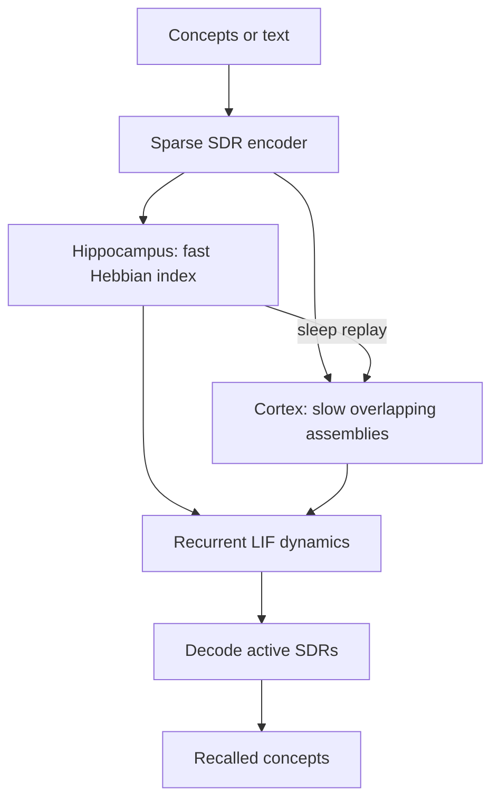
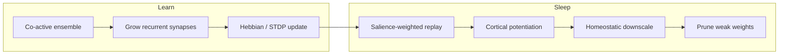

# BrainMemory

**BrainMemory** is an experimental, biologically *inspired* memory system. It stores information by changing a sparse recurrent network — neuron activations and synaptic weights — instead of writing rows into a database.

A memory exists because the network changed. If the synapses are deleted, the memories disappear.

This is **not** a simulation of a human brain, a claim of consciousness, or a drop-in vector database.

---

## What it is

- A sparse leaky-integrate-and-fire network (default 10,000 neurons, tens to hundreds of connections each)
- Hippocampal **fast** one-shot episodic binding + cortical **slow** semantic association (complementary learning systems)
- Hebbian plasticity, optional STDP, replay, sleep, consolidation, decay, and pruning
- Pattern completion from partial cues and pattern separation of similar episodes
- A real synaptic substrate: COO weights on CUDA, Apple Silicon MPS, or CPU

## What it is not

- Not biologically accurate (no ions, no cortical layers, no real neuromodulators)
- Not a vector database, FAISS/Pinecone/Chroma index, SQL store, or RAG pipeline
- Not an LLM context window (an optional LLM may *extract concepts from text only*)
- Not a human-level memory model and not a claim of emotions or awareness

The encoder's concept→neuron map is a **sensory codebook**, analogous to knowing which receptors correspond to which features. It is not the memory. Recall walks the synaptic graph.

---

## Architecture

```text
                    INPUT
                      │
                      ▼
              ┌──────────────┐
              │ Input Encoder│  (sparse concept SDRs)
              └───────┬──────┘
                      │
          sparse activation pattern
                      │
                      ▼
              ┌───────────────┐
              │ HIPPOCAMPUS   │  fast learning, episodic index
              │ pattern sep.  │
              └───────┬───────┘
                      │
            replay / consolidation
                      │
                      ▼
              ┌───────────────┐
              │ CORTEX        │  slow learning, shared structure
              │ associations  │
              └───────┬───────┘
                      │
                      ▼
            PATTERN COMPLETION
                      │
                      ▼
                   RECALL
```





**Scientific lineage (inspired by, not copied from):** Hebbian learning, Hopfield-style attractors, sparse coding / SDRs, hippocampal indexing, complementary learning systems, synaptic homeostasis, sharp-wave-ripple-like replay, pattern separation (DG) and completion (CA3).

---

## Installation

Python 3.10+ recommended.

```bash
git clone https://github.com/TheNickCoolst/brainmemory.git
cd brainmemory
python -m venv .venv
source .venv/bin/activate   # Windows: .venv\Scripts\activate
pip install -e .
pytest
python examples/demo_brain.py
```

Device selection is automatic: **CUDA → MPS → CPU**.

---

## How the model answers

The brain does not chat from a document store. A question is encoded into cue neurons, the sparse net completes the pattern, and the readout names the concepts that fired.

```bash
python examples/talk.py --device mps
python examples/talk.py "Was ist der Hippocampus?"
```

```python
brain = Brain.live(device="mps")   # same file, GPU if available
out = brain.ask("Was ist der Hippocampus?")
print(out["answer"])
print(out["recalled_concepts"], out["confidence"])
```

On Apple Silicon, **MPS is the GPU** and it shares RAM with the CPU — it is faster, not extra memory. Optional `BRAINMEMORY_SPEAK=1` lets an LLM *phrase* the recalled concepts; it must not invent facts.

## One lifelong brain

Do **not** train a new network each time. Open the same brain; it keeps its synapses, grows new neurons, and learns the next batch.

```bash
python examples/live_brain.py              # one cycle, saves ~/.brainmemory/live.pt
python examples/live_brain.py --cycles 5   # five more cycles on the SAME brain
python examples/live_brain.py --forever    # until Ctrl+C; saves after every cycle
python examples/live_brain.py --until-limit  # keep growing until this machine is nearly out of RAM
python examples/live_brain.py --status     # neurons / synapses / concepts so far
python examples/live_brain.py --web        # also forage Wikipedia
```

```python
from brainmemory import Brain

brain = Brain.live()          # loads ~/.brainmemory/live.pt or creates it once
brain.explore("hippocampus")
brain.grow(64)                # neurogenesis: old memories keep their neuron ids
brain.checkpoint()            # write the same file
```

Next session: `Brain.live()` again. Same weights. Same engrams. More of both after each cycle.

## Autonomous learning

The network can fetch its own sensory input, then learn by changing synapses:

```text
curiosity / seed topic
        │
        ▼
   fetch (Wikipedia, local files)
        │
        ▼
   novelty gate
        │
        ▼
   brain.learn(...)     ← synaptic change
        │
        ▼
   sleep / consolidate
        │
        ▼
   weak recall → next queries
```

Fetched pages are **not** the memory. They are raw input, like vision. If you zero the weights, the foraged facts disappear.

```python
brain = Brain(BrainConfig.small())

# local folder of .txt / .md files
brain.ingest("examples/corpus")

# curiosity loop: fetch, learn, sleep, chase knowledge gaps
brain.explore("hippocampus", steps=6)

print(brain.recall(["hippocampus"])["recalled_concepts"])
```

```bash
python examples/demo_autonomous.py
python examples/demo_autonomous.py --web hippocampus schlaf
```

`--web` uses the Wikipedia API (no key). Default language is German.

## First example

```python
from brainmemory import Brain, BrainConfig

brain = Brain(BrainConfig.small())

brain.learn(["dog", "golden retriever", "park", "ball"], importance=0.8)
result = brain.recall(["golden retriever"])

print(result["recalled_concepts"])
print(result["confidence"], result["engram_size"])

brain.sleep()
brain.save("artifacts/brain.pt")
brain = Brain.load("artifacts/brain.pt")
```

Text input uses a deterministic tokenizer (no API key). An external model may extract concepts only if `BRAINMEMORY_LLM_EXTRACTOR=1` and an API key is set; it still does **not** store the memory.

```python
brain.learn_text("An apple is a sweet fruit that can be red.")
print(brain.recall_text("red")["recalled_concepts"])
```

---

## How learning works

1. Each concept is hashed to a **fixed sparse set of cortical neurons** (an SDR).
2. The hippocampus allocates a mostly **unique episodic index** (pattern separation).
3. Structural plasticity **grows** recurrent synapses among the co-active ensemble.
4. Several Hebbian steps (and optional STDP) **raise those weights**, with soft bounds and synaptic scaling so they cannot explode.
5. A hippocampal trace stores the *neuron IDs* and salience tags for later replay. It does **not** store the answer strings used at recall.

Importance, novelty, reward, recency, and retrieval frequency combine into a salience signal. Salient memories replay more, decay less, and consolidate more strongly.

---

## How recall works

1. Cue concepts activate their SDRs.
2. Those cells are clamped for a few steps, then the recurrent network runs (k-WTA + LIF).
3. Strengthened intra-engram synapses complete the pattern.
4. Known concept SDRs are scored by overlap with the **active** population.

There is no nearest-neighbor lookup over stored fact records.

---

## Hippocampus

Fast learner. One or few exposures can bind an episode. Representations are sparse and strongly pattern-separated so “Nick / Monday / Math / Room 204” does not collapse into “Nick / Tuesday / Physics / Room 204”.

This is an index ensemble plus recurrent binding — not a JSON object with those fields.

## Cortex

Slow learner. Repeated experiences (and sleep replay) carve overlapping assemblies. Many apple episodes share the `apple` / `fruit` neurons, which is how a more semantic APPLE-like structure can emerge.

## Consolidation

`brain.consolidate()` and the sleep cycle replay hippocampal ensembles onto cortex with a boosted cortical learning rate so recurring structure becomes cortical. After enough replay, `recall(..., use_hippocampus=False)` can still complete the pattern.

## Sleep / replay

`brain.sleep()` performs:

| Operation | Role |
|---|---|
| Replay | Salience-weighted reactivation of hippocampal ensembles |
| Consolidation | Cortical Hebbian / STDP on replayed patterns |
| Linking | Overlapping traces grow extra associations |
| Downscaling | Global synaptic homeostasis |
| Decay + pruning | Unused weak weights fade and drop out |

It returns counts: memories replayed, synapses strengthened/weakened/pruned, new associations.

## Forgetting

Mandatory and synaptic: decay, extra decay for unused synapses, pruning below threshold, interference from overlapping ensembles, reduced accessibility. Memories are not deleted by timestamp. Recalling a memory with new information **reconsolidates** it (old ensemble mixed with new content, heterosynaptic depression of stale partners).

---

## Configuration

See `config/default.yaml`. Defaults:

| Key | Default |
|---|---|
| neurons | 10,000 |
| avg_connections | 64 |
| hippocampus LR | 0.18 |
| cortex LR | 0.02 |
| sparsity / bits per concept | ~40 cortical cells / concept |
| sleep replay_count | 48 |

`BrainConfig.tiny()` and `.small()` exist for tests.

---

## Benchmarks

```bash
python benchmarks/scale_benchmark.py
```

Measured on Apple Silicon (PyTorch MPS), BrainMemory v0.1:

| Neurons | Synapses | Init (s) | Learn (s) | Recall (s) | Sleep (s) | RSS (MB) |
| ---: | ---: | ---: | ---: | ---: | ---: | ---: |
| 1,000 | 49k | 0.07 | 0.07 | 0.19 | 0.01 | 347 |
| 10,000 | 486k | 0.10 | 0.07 | 0.02 | 0.02 | 456 |
| 25,000 | 1.2M | 0.27 | 0.10 | 0.04 | 0.02 | 624 |
| 50,000 | 1.6M | 0.40 | 0.10 | 0.07 | 0.02 | 820 |
| 100,000 | 3.2M | 1.04 | 0.28 | 0.11 | 0.04 | 1016 |

Re-run on your machine; CUDA/CPU numbers will differ. Sparse COO, no dense N×N.

---

## Tests and experiments

```bash
pytest
python experiments/run_all.py
```

Experiments cover basic memory, partial recall, related memories, pattern separation, forgetting, reinforcement, sleep, and consolidation.

---

## Limitations (honest)

- Discrete-time LIF + k-WTA is a **computational stand-in** for inhibition, not a detailed interneuron circuit.
- STDP uses a classical exponential kernel on stored spike times, not calcium / eligibility cascades.
- Concept identity is a hash SDR; there is no sensory hierarchy or true language understanding.
- Capacity, catastrophic interference, and sequence memory are only partly addressed. Very similar episodes still leak (shared tokens remain shared); they are distinguishable by score, not perfectly isolated.
- 1,000,000 neurons is architecturally in range (sparse COO) but not the default; profile before jumping there.
- Visualization samples local graphs — it will not draw millions of synapses.

## Roadmap

- Reward-modulated STDP and novelty-gated dopamine-like gain
- Structural neurogenesis / dynamic population growth
- Temporal sequence / timeline memory
- Hierarchical cortical regions and predictive coding
- Stronger inhibitory populations and attention-like gating
- Scale study to 100k–1M with batched sparse kernels

---

## Project layout

```text
brainmemory/          # library
experiments/          # eight reproducible experiments
benchmarks/           # scale timing / RAM
examples/demo_brain.py
tests/                # pytest
config/default.yaml
```
